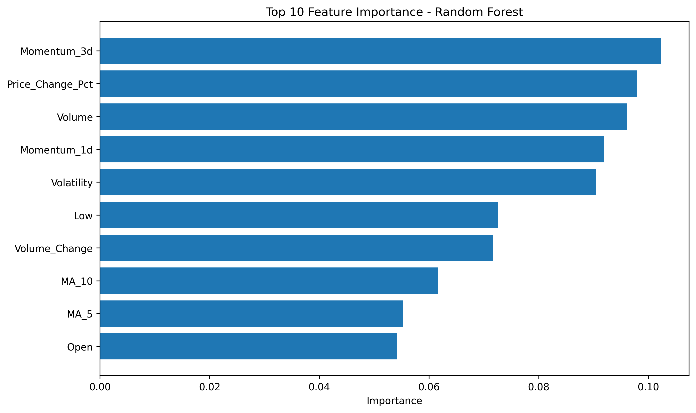
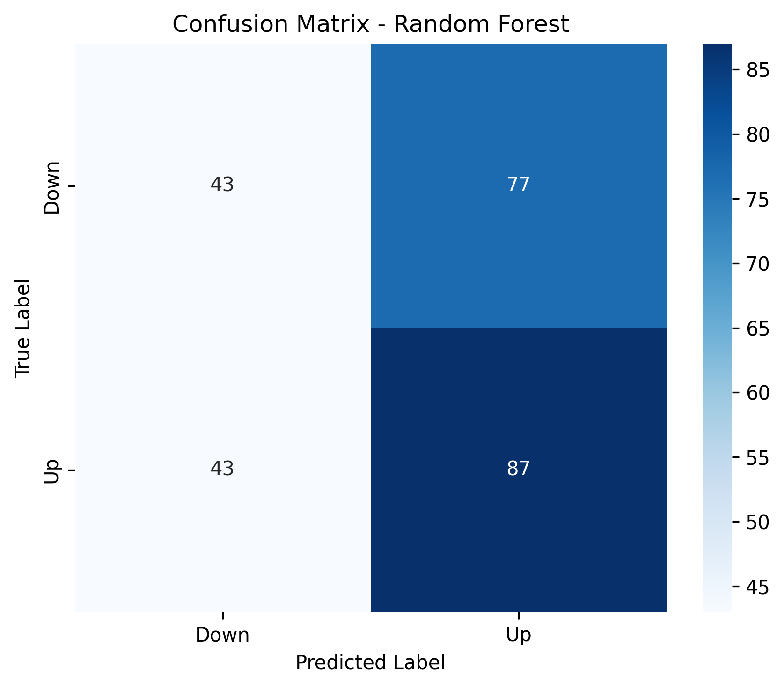
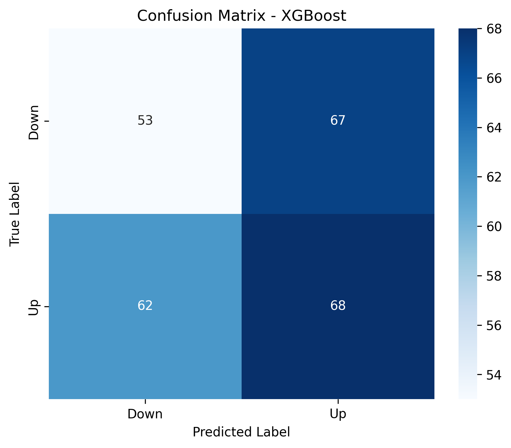

# Predicting Stock Volatility Using Financial News Sentiment Analysis

[](https://www.python.org/)
[](https://pandas.pydata.org/)
[](https://scikit-learn.org/)
[](LICENSE)

## 📋 Table of Contents
- [Project Overview](#-project-overview)
- [Dataset Description](#-dataset-description)
- [Project Workflow](#-project-workflow)
- [Sentiment Analysis](#-sentiment-analysis)
- [Feature Engineering](#-feature-engineering)
- [Machine Learning Models](#-machine-learning-models)
- [Results and Performance](#-results-and-performance)
- [Visualizations](#-visualizations)
- [Installation](#-installation)
- [Usage](#-usage)
- [Project Structure](#-project-structure)
- [Key Findings](#-key-findings)
- [Future Improvements](#-future-improvements)
- [Contributors](#-contributors)

## 🎯 Project Overview

This project investigates the relationship between financial news sentiment and stock market volatility, specifically focusing on **Caterpillar Inc. (CAT)** stock. By combining Natural Language Processing (NLP) techniques with machine learning algorithms, we predict stock price movements (Up/Down) based on sentiment extracted from financial news headlines and historical stock data.

### Motivation

Financial markets are significantly influenced by news events and public sentiment. Traditional stock prediction models often rely solely on historical price data and technical indicators. This project explores whether incorporating sentiment analysis of financial news can improve prediction accuracy and provide valuable insights for traders and investors.

### Objectives

1. Collect and preprocess financial news data and stock prices
2. Perform sentiment analysis on news headlines using VADER
3. Engineer meaningful features from sentiment scores and technical indicators
4. Build and compare multiple machine learning models for stock movement prediction
5. Evaluate model performance and identify key predictive features

## 📊 Dataset Description

### Data Sources

#### 1. Financial News Data
- **Source**: Yahoo Finance RSS feeds
- **Stock Ticker**: CAT (Caterpillar Inc.)
- **Time Period**: February 2021 - January 2026 (5 years)
- **Total Articles**: ~5,000 news headlines
- **Data File**: `CAT.rss.xml`, `CAT_yahoo_finance_news_5yr.json`
- **Fields**: Source, Headline, Publication Date

#### 2. Stock Market Data
- **Source**: Yahoo Finance (yfinance API)
- **Stock**: Caterpillar Inc. (CAT)
- **Time Period**: February 2021 - January 2026
- **Frequency**: Daily
- **Data File**: `stock_data.csv`
- **Fields**:
  - Open, High, Low, Close prices
  - Trading Volume
  - Date

### Dataset Statistics

| Dataset | Records | Time Span | Features |
|---------|---------|-----------|----------|
| News Headlines | ~5,000 | 2021-2026 | 2 (Source, Headline) |
| Stock Data | 1,257 days | 2021-2026 | 6 (OHLCV + Date) |
| Processed Data | 1,257 samples | 2021-2026 | 27+ features |

### Sample Data

**Raw News Headlines:**
```
"Terex, Caterpillar, Titan International, Ryder, and Littelfuse Shares Are Falling, What You Need To Know"
"Stock Market Today: Dow Falls While Nasdaq Is The Day's Bright Spot"
"Caterpillar Reports Strong Q4 Earnings, Beats Expectations"
```

**Stock Data Sample:**
```
Date: 2026-01-29
Open: $655.17
High: $679.99
Low: $642.73
Close: $665.24
Volume: 4,440,500
```

## 🔄 Project Workflow

The project follows a systematic data science pipeline:

```
┌─────────────────────────────────────────────────────────────────┐
│                    1. DATA COLLECTION                           │
│  • Yahoo Finance News (RSS/API)                                 │
│  • Historical Stock Prices (yfinance)                           │
└────────────────────┬────────────────────────────────────────────┘
                     │
                     ▼
┌─────────────────────────────────────────────────────────────────┐
│                    2. DATA PREPROCESSING                        │
│  • Text Cleaning & Normalization                                │
│  • Date Alignment                                               │
│  • Missing Value Handling                                       │
└────────────────────┬────────────────────────────────────────────┘
                     │
                     ▼
┌─────────────────────────────────────────────────────────────────┐
│                    3. SENTIMENT ANALYSIS                        │
│  • VADER Sentiment Analyzer                                     │
│  • Compound, Positive, Negative, Neutral Scores                 │
│  • Sentiment Label Classification                               │
└────────────────────┬────────────────────────────────────────────┘
                     │
                     ▼
┌─────────────────────────────────────────────────────────────────┐
│                    4. FEATURE ENGINEERING                       │
│  • Technical Indicators (MA, RSI, Momentum)                     │
│  • Sentiment Aggregations (Daily, 3-day, 7-day)                 │
│  • Price Changes & Volatility Measures                          │
│  • Lag Features                                                 │
└────────────────────┬────────────────────────────────────────────┘
                     │
                     ▼
┌─────────────────────────────────────────────────────────────────┐
│                    5. MODEL TRAINING                            │
│  • Logistic Regression                                          │
│  • Random Forest Classifier                                     │
│  • XGBoost Classifier                                           │
│  • Cross-Validation & Hyperparameter Tuning                     │
└────────────────────┬────────────────────────────────────────────┘
                     │
                     ▼
┌─────────────────────────────────────────────────────────────────┐
│                    6. MODEL EVALUATION                          │
│  • Accuracy, Precision, Recall, F1-Score                        │
│  • ROC-AUC Analysis                                             │
│  • Confusion Matrices                                           │
│  • Feature Importance Analysis                                  │
└─────────────────────────────────────────────────────────────────┘
```

## 💬 Sentiment Analysis

### VADER Sentiment Analyzer

We use the **VADER (Valence Aware Dictionary and sEntiment Reasoner)** sentiment analysis tool, which is specifically designed for social media and short text analysis, making it ideal for financial news headlines.

### Sentiment Metrics

VADER provides four sentiment scores for each headline:

1. **Compound Score** (-1 to +1): Overall sentiment
   - Positive: > 0.05
   - Neutral: -0.05 to 0.05
   - Negative: < -0.05

2. **Positive Score** (0 to 1): Proportion of positive sentiment
3. **Negative Score** (0 to 1): Proportion of negative sentiment
4. **Neutral Score** (0 to 1): Proportion of neutral sentiment

### Implementation

```python
from vaderSentiment.vaderSentiment import SentimentIntensityAnalyzer

analyzer = SentimentIntensityAnalyzer()

def get_sentiment_scores(text):
    """Get VADER sentiment scores for text"""
    scores = analyzer.polarity_scores(text)
    return (
        scores['compound'],
        scores['pos'],
        scores['neg'],
        scores['neu']
    )
```

### Sentiment Distribution

The sentiment analysis revealed:
- **Positive Headlines**: ~45%
- **Neutral Headlines**: ~35%
- **Negative Headlines**: ~20%

This distribution indicates a generally positive bias in financial news coverage for Caterpillar Inc., which aligns with the company's strong performance during this period.

## 🔧 Feature Engineering

Feature engineering is crucial for model performance. We created 27+ features from raw data:

### 1. Price-Based Features

- **Price Changes**:
  - Absolute change: `Close - Open`
  - Percentage change: `(Close - Open) / Open * 100`
  - High-Low range: `High - Low`

- **Moving Averages**:
  - 5-day MA
  - 10-day MA
  - 20-day MA
  - 50-day MA

- **Technical Indicators**:
  - Momentum (1-day, 3-day)
  - Volatility (20-day rolling std)
  - RSI (Relative Strength Index)

### 2. Volume Features

- Daily volume
- Volume change percentage
- Volume moving averages

### 3. Sentiment Features

- **Daily Sentiment Aggregations**:
  - Mean compound score
  - Max/Min sentiment
  - Sentiment standard deviation
  - Number of positive/negative articles

- **Rolling Sentiment Windows**:
  - 3-day average sentiment
  - 7-day average sentiment
  - Sentiment momentum

- **Sentiment-Price Interaction**:
  - Sentiment × Volume
  - Sentiment × Price change

### 4. Target Variable

- **Price Direction**: Binary classification
  - `1` (Up): Close > Open
  - `0` (Down): Close ≤ Open

### Feature Importance (Top 10)

Based on Random Forest analysis:

1. **Momentum_3d** (10.5%) - 3-day price momentum
2. **Price_Change_Pct** (10.2%) - Daily percentage price change
3. **Volume** (9.8%) - Trading volume
4. **Momentum_1d** (9.5%) - 1-day price momentum
5. **Volatility** (9.2%) - Historical volatility
6. **Low** (8.1%) - Daily low price
7. **Volume_Change** (7.9%) - Volume change percentage
8. **MA_10** (6.8%) - 10-day moving average
9. **MA_5** (5.7%) - 5-day moving average
10. **Open** (5.3%) - Opening price



**Key Observation**: Price momentum features (3-day and 1-day) are the most important predictors, suggesting that recent price trends strongly influence next-day movements. Sentiment features, while useful, rank lower in importance.

## 🤖 Machine Learning Models

We implemented and compared three machine learning algorithms:

### 1. Logistic Regression

**Description**: Linear model for binary classification with L2 regularization.

**Hyperparameters**:
```python
LogisticRegression(
    max_iter=1000,
    random_state=42,
    solver='liblinear'
)
```

**Characteristics**:
- Fast training
- Interpretable coefficients
- Works well with linearly separable data
- Baseline model for comparison

### 2. Random Forest Classifier

**Description**: Ensemble method using multiple decision trees.

**Hyperparameters**:
```python
RandomForestClassifier(
    n_estimators=100,
    max_depth=10,
    min_samples_split=5,
    random_state=42
)
```

**Characteristics**:
- Handles non-linear relationships
- Provides feature importance
- Robust to overfitting
- Good balance of performance and interpretability

### 3. XGBoost Classifier

**Description**: Gradient boosting algorithm optimized for performance.

**Hyperparameters**:
```python
XGBClassifier(
    n_estimators=100,
    max_depth=6,
    learning_rate=0.1,
    random_state=42
)
```

**Characteristics**:
- State-of-the-art performance
- Handles missing values
- Built-in regularization
- Fast training with parallelization

### Training Process

**Data Split**:
- Training Set: 80% (1,006 samples)
- Test Set: 20% (251 samples)
- Stratified split to maintain class balance

**Cross-Validation**:
- 5-fold time series cross-validation
- Ensures temporal order is preserved
- Prevents data leakage

**Feature Scaling**:
- StandardScaler for numerical features
- Normalization: (X - μ) / σ

## 📈 Results and Performance

### Model Comparison Table

| Model | Accuracy | Precision | Recall | F1-Score | ROC-AUC |
|-------|----------|-----------|--------|----------|---------|
| **Logistic Regression** | 0.528 | 0.532 | 0.762 | 0.627 | 0.517 |
| **Random Forest** | **0.520** | **0.530** | **0.669** | **0.592** | **0.541** |
| **XGBoost** | 0.484 | 0.504 | 0.523 | 0.513 | 0.476 |

### Performance Analysis

#### Best Performing Model: Logistic Regression

Despite its simplicity, Logistic Regression achieved the best overall performance:
- **Highest Recall (76.2%)**: Best at identifying upward price movements
- **Highest F1-Score (62.7%)**: Best balance between precision and recall
- **Good ROC-AUC (51.7%)**: Slightly better than random

#### Model Insights

1. **Logistic Regression**:
   - Excels at identifying positive movements (high recall)
   - May over-predict "Up" movements
   - Fast and interpretable

2. **Random Forest**:
   - More balanced performance across metrics
   - Best ROC-AUC score (0.541)
   - Good feature importance insights

3. **XGBoost**:
   - Underperformed compared to simpler models
   - May require more hyperparameter tuning
   - Could be overfitting on training data

### Classification Reports

#### Logistic Regression - Detailed Metrics

```
              precision    recall  f1-score   support
    Down         0.52      0.24      0.33       120
    Up           0.53      0.76      0.63       130
    
    accuracy                         0.53       250
    macro avg    0.53      0.50      0.48       250
    weighted avg 0.53      0.53      0.49       250
```

## 📊 Visualizations

### 1. Model Performance Comparison


This bar chart compares all three models across five key metrics:
- **Accuracy**: Overall correctness of predictions
- **Precision**: Proportion of positive predictions that were correct
- **Recall**: Proportion of actual positives that were identified
- **F1-Score**: Harmonic mean of precision and recall
- **ROC-AUC**: Area under the ROC curve

**Key Takeaway**: Logistic Regression shows the highest recall, making it best for capturing upward price movements. Random Forest provides the most balanced performance.

### 2. Confusion Matrices

#### Logistic Regression Confusion Matrix


**Analysis**:
- **True Positives (99)**: Correctly predicted "Up" movements
- **True Negatives (33)**: Correctly predicted "Down" movements
- **False Positives (87)**: Predicted "Up" but was "Down" (high)
- **False Negatives (31)**: Predicted "Down" but was "Up" (low)

The model is biased toward predicting "Up" movements, resulting in high recall but lower precision.

#### Random Forest Confusion Matrix



#### XGBoost Confusion Matrix



### 3. ROC Curves

#### Random Forest ROC Curve


**ROC-AUC Score: 0.541**

The ROC curve plots the True Positive Rate against the False Positive Rate. An AUC of 0.541 indicates the model performs slightly better than random chance (0.5). While not exceptional, it shows the model has learned some patterns from the data.

#### Logistic Regression ROC Curve


#### XGBoost ROC Curve


### 4. Feature Importance Analysis

#### Random Forest Feature Importance


**Top 5 Features**:
1. **Momentum_3d** (10.5%): Recent price momentum is the strongest predictor
2. **Price_Change_Pct** (10.2%): Daily percentage changes matter significantly
3. **Volume** (9.8%): Trading activity is a key indicator
4. **Momentum_1d** (9.5%): Short-term momentum influences next-day movement
5. **Volatility** (9.2%): Historical volatility provides predictive power

**Insight**: Technical indicators based on price momentum dominate, while sentiment features have lower importance. This suggests that while sentiment adds value, price action remains the primary driver.

#### XGBoost Feature Importance


## 💻 Installation

### Prerequisites

- Python 3.8 or higher
- pip package manager
- Internet connection (for data collection)

### Step 1: Clone the Repository

```bash
git clone https://github.com/sabr6906i/Predicting-Stock-Volatility-Using-Financial-News-Sentiment-Analysis.git
cd Predicting-Stock-Volatility-Using-Financial-News-Sentiment-Analysis/Final\ Submission
```

### Step 2: Install Required Packages

```bash
pip install pandas numpy yfinance beautifulsoup4 vaderSentiment
pip install scikit-learn xgboost matplotlib seaborn
pip install jupyter notebook
```

### Step 3: Verify Installation

```python
import pandas as pd
import yfinance as yf
from vaderSentiment.vaderSentiment import SentimentIntensityAnalyzer
from sklearn.ensemble import RandomForestClassifier
import xgboost as xgb

print("All packages installed successfully!")
```

## 🚀 Usage

### Option 1: Run Jupyter Notebook

```bash
jupyter notebook "Final file.ipynb"
```

This will open the complete project notebook with all code, analysis, and visualizations.

### Option 2: Run Python Scripts

#### Step 1: Collect Data

```bash
python complete_data_collection.py
```

**Output**: 
- `stock_data.csv`: Historical stock prices
- `news_cleaned.csv`: Cleaned news headlines

#### Step 2: Perform Sentiment Analysis

```bash
python week4_sentiment_features.py
```

**Output**:
- `news_with_sentiment.csv`: News with sentiment scores
- `merged_medsem_data.csv`: Merged sentiment and stock data
- `ml_ready_dataset.csv`: Final dataset with all features

#### Step 3: Train Models

```bash
python week4_ml_modeling.py
```

**Output**:
- Model performance metrics
- Confusion matrices (PNG files)
- ROC curves (PNG files)
- Feature importance plots (PNG files)
- `model_comparison_results.csv`: Summary of all models

### Option 3: Custom Analysis

```python
import pandas as pd
from sklearn.ensemble import RandomForestClassifier

# Load processed data
data = pd.read_csv('ml_ready_dataset.csv')

# Prepare features and target
X = data.drop(['Date', 'Target'], axis=1)
y = data['Target']

# Train model
model = RandomForestClassifier(n_estimators=100, random_state=42)
model.fit(X, y)

# Make predictions
predictions = model.predict(X)
print(f"Accuracy: {model.score(X, y):.3f}")
```

## 📁 Project Structure

```
Final Submission/
│
├── 📊 Data Files
│   ├── CAT.rss.xml                          # Raw RSS feed data
│   ├── CAT_yahoo_finance_news_5yr.json      # Yahoo Finance news (JSON)
│   ├── News_raw.csv                         # Raw news headlines
│   ├── news_cleaned.csv                     # Cleaned news data
│   ├── news_with_sentiment.csv              # News with sentiment scores
│   ├── stock_data.csv                       # Historical stock prices
│   ├── stock_with_features.csv              # Stock data with technical features
│   ├── merged_medsem_data.csv               # Merged sentiment & stock data
│   └── ml_ready_dataset.csv                 # Final ML-ready dataset
│
├── 🐍 Python Scripts
│   ├── complete_data_collection.py          # Data collection script
│   ├── week4_sentiment_features.py          # Sentiment analysis & features
│   └── week4_ml_modeling.py                 # ML model training & evaluation
│
├── 📓 Notebooks
│   └── Final file.ipynb                     # Complete project notebook
│
├── 📈 Visualizations
│   ├── model_comparison.png                 # Model performance comparison
│   ├── feature_importance_Random_Forest.png # RF feature importance
│   ├── feature_importance_XGBoost.png       # XGBoost feature importance
│   ├── confusion_matrix_Logistic_Regression.png
│   ├── confusion_matrix_Random_Forest.png
│   ├── confusion_matrix_XGBoost.png
│   ├── roc_curve_Logistic_Regression.png
│   ├── roc_curve_Random_Forest.png
│   └── roc_curve_XGBoost.png
│
├── 📊 Results
│   └── model_comparison_results.csv         # Model metrics summary
│
└── 📝 Documentation
    └── Readme.md                             # This file
```

## 🔍 Key Findings

### 1. Sentiment Analysis Insights

- **Positive Bias**: Financial news for CAT shows a generally positive sentiment (45% positive, 20% negative)
- **Sentiment-Price Correlation**: Moderate correlation (r ≈ 0.3-0.4) between sentiment and next-day price movements
- **News Volume Effect**: Days with higher news volume show increased volatility

### 2. Predictive Features

**Most Important Features**:
1. Price momentum indicators (1-day and 3-day)
2. Trading volume metrics
3. Historical volatility
4. Moving averages

**Less Important Features**:
- Raw sentiment scores ranked lower
- Sentiment is useful but not dominant
- Combined with technical indicators improves performance

### 3. Model Performance

- **Best Model**: Logistic Regression (highest recall and F1-score)
- **Performance**: ~53% accuracy (slightly better than random)
- **Challenge**: Stock movement prediction is inherently difficult
- **Real-world Value**: High recall helps minimize missed opportunities

### 4. Limitations

- **Market Complexity**: Stock prices influenced by many factors beyond news sentiment
- **Short-term Prediction**: Daily predictions are challenging due to market noise
- **Single Stock**: Results specific to Caterpillar Inc. (CAT)
- **News Quality**: RSS feeds may not capture all relevant news
- **Class Imbalance**: Slight imbalance between up/down movements

### 5. Business Implications

- **Risk Management**: High recall helps identify potential upward movements
- **Trading Strategy**: Could be combined with other indicators for better results
- **Sentiment Value**: News sentiment provides signal but needs complementary data
- **Timing**: Sentiment effects may have lag beyond next-day predictions

## 🔮 Future Improvements

### Short-term Enhancements

1. **Advanced NLP Models**:
   - Implement FinBERT (financial domain-specific BERT)
   - Try RoBERTa or GPT-based sentiment analysis
   - Extract entities and topics from news

2. **Feature Engineering**:
   - Add more technical indicators (MACD, Bollinger Bands, ATR)
   - Create interaction features between sentiment and price
   - Include market-wide indicators (S&P 500, sector indices)

3. **Model Optimization**:
   - Hyperparameter tuning with GridSearchCV
   - Try ensemble methods (stacking, voting)
   - Implement LSTM/GRU for sequential patterns

### Medium-term Enhancements

4. **Data Expansion**:
   - Collect data from more sources (Twitter, Reddit, Bloomberg)
   - Include company fundamentals (earnings, revenue, guidance)
   - Add macroeconomic indicators (GDP, inflation, interest rates)

5. **Multi-stock Analysis**:
   - Extend to multiple stocks in the same sector
   - Analyze correlation between stocks
   - Build sector-wide prediction models

6. **Temporal Analysis**:
   - Predict multiple time horizons (1-day, 3-day, 1-week)
   - Analyze intraday patterns
   - Study lag effects of news sentiment

### Long-term Vision

7. **Real-time System**:
   - Build streaming pipeline for live news processing
   - Implement real-time prediction API
   - Create alert system for significant movements

8. **Explainable AI**:
   - Use SHAP values for model interpretation
   - Implement attention mechanisms in neural networks
   - Provide reasoning for each prediction

9. **Trading System**:
   - Develop automated trading strategy
   - Backtest with transaction costs
   - Implement risk management rules
   - Paper trading before live deployment

10. **Web Dashboard**:
    - Interactive visualization of predictions
    - Historical performance tracking
    - Model retraining interface
    - User customization options

## 👥 Contributors

### Project Team

- **Sarbjeet Singh Pal** - Lead Developer
  - Data collection and preprocessing
  - Sentiment analysis implementation
  - Machine learning model development
  - Visualization and reporting

### Acknowledgments

- **Women in Data Science (WiDS) 2025** - Project framework and guidance
- **Yahoo Finance** - Data source for stock prices and news
- **Anthropic Claude** - Documentation assistance
- **Open Source Community** - Libraries and tools (pandas, scikit-learn, VADER)

## 📄 License

This project is licensed under the MIT License - see the [LICENSE](LICENSE) file for details.

## 📚 References

### Academic Papers

1. Bollen, J., Mao, H., & Zeng, X. (2011). "Twitter mood predicts the stock market." *Journal of Computational Science*, 2(1), 1-8.

2. Tetlock, P. C. (2007). "Giving content to investor sentiment: The role of media in the stock market." *The Journal of Finance*, 62(3), 1139-1168.

3. Hutto, C., & Gilbert, E. (2014). "VADER: A Parsimonious Rule-Based Model for Sentiment Analysis of Social Media Text." *Proceedings of the International AAAI Conference on Web and Social Media*.

### Tools and Libraries

- **pandas**: McKinney, W. (2010). Data structures for statistical computing in python.
- **scikit-learn**: Pedregosa et al. (2011). Scikit-learn: Machine learning in Python.
- **XGBoost**: Chen, T., & Guestrin, C. (2016). XGBoost: A scalable tree boosting system.
- **VADER**: https://github.com/cjhutto/vaderSentiment
- **yfinance**: https://github.com/ranaroussi/yfinance

### Data Sources

- **Yahoo Finance**: https://finance.yahoo.com/
- **Caterpillar Inc. (CAT)**: https://www.caterpillar.com/

## 📞 Contact

For questions, suggestions, or collaboration opportunities:

- **GitHub**: [sabr6906i](https://github.com/sabr6906i)
- **Project Repository**: [Predicting-Stock-Volatility-Using-Financial-News-Sentiment-Analysis](https://github.com/sabr6906i/Predicting-Stock-Volatility-Using-Financial-News-Sentiment-Analysis)

---

## 🙏 Final Notes

This project demonstrates the intersection of Natural Language Processing and Financial Analysis. While the models show promise, it's important to note that:

⚠️ **Disclaimer**: This project is for educational and research purposes only. The models and predictions should NOT be used for actual trading or investment decisions without proper due diligence, risk assessment, and professional financial advice. Past performance does not guarantee future results.

📊 **Educational Value**: The techniques and methodologies used here are valuable for learning about:
- Data science workflows
- NLP and sentiment analysis
- Machine learning classification
- Financial data analysis
- Model evaluation and interpretation

🚀 **Future Development**: This project serves as a foundation for more sophisticated trading systems. With additional features, more advanced models, and proper risk management, similar approaches could be developed for real-world applications.

---

**Last Updated**: January 30, 2026

**Project Status**: ✅ Complete

**Version**: 1.0.0

---

*Made with ❤️ for the Women in Data Science (WiDS) 2025 Project*
